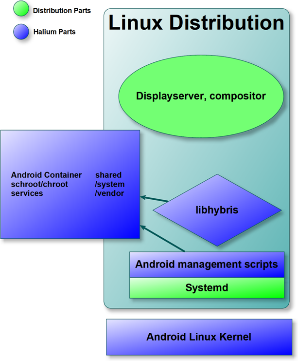

---
# You don't need to edit this file, it's empty on purpose.
# Edit theme's home layout instead if you wanna make some changes
# See: https://jekyllrb.com/docs/themes/#overriding-theme-defaults
layout: home
title: "Halium Project"
---

# Halium

## Introduction

Halium is the collaborative project to unify the Hardware Abstraction Layer for projects which run GNU/Linux on mobile devices with pre-installed Android.

Project Halium will contain:

- Linux kernel (source provided by device vendor)
- Android services required to talk with hardware
- Libhybris

In addition, Project Halium also aims to standardize the middleware software used by various projects to talk with android daemons and make use of hardware, for instance:

- OFono/RILd
- Camera service
- Pulseaudio / Audiofingerglue
- GPS
- Media codecs

This project will not control the following higher level parts of the stack. Each distribution controls these aspects:

- Display server
- Toolkit
- User interface
- Applications

## Frequently Asked Questions

### Why is Systemd involved? Why can't this be init-system agnostic?

Some hardware functionalities (Mobile Radio, sensors...) are provided by Android services, which must be started at boot time. Therefore an integration in the init system is needed.

### The component *x* is common to all distributions; why not include it in Halium?

Each distribution has its own way of integrating and building its components. Most of the time, the same upstream is already used, so the efforts are already mostly shared. Moreover, Halium wants to address a well identified target, i.e. the hardware abstraction layer using the Android drivers.

Most distributions are discussing with one another to work towards using the same components.

### Which communities are involved with Halium?

[LuneOS](http://www.webos-ports.org/wiki/Main_Page), [Ubuntu Touch](https://ubuntu-touch.io)... We're only missing you!

### Why aren't you enhancing the Mer Project instead of creating a new one?

The [Mer project](http://merproject.org/) is not comparable to Halium. Mer "Develops the base operating system software for use in devices like phones [...]", while Halium is only for Hardware Abstraction. Mer should be adaptable to use Halium.
